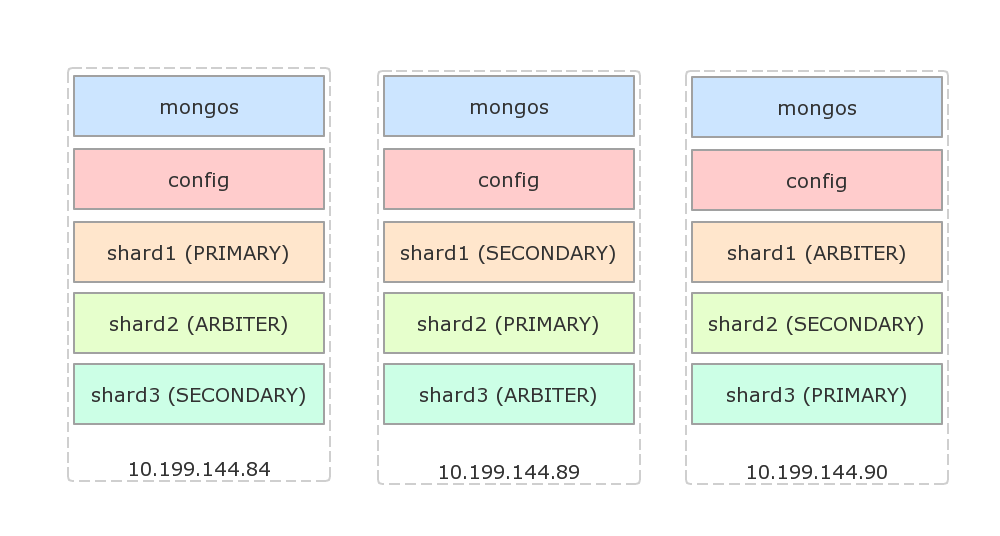

# MongoDB分片部署实战

本篇记录MongoDB高可用模式部署步骤，其他部署方式见[上一篇](https://github.com/chemdemo/chemdemo.github.io/issues/8)。

首先准备机器，我这里是在公司云平台创建了三台DB server，ip分别是10.199.144.84，10.199.144.89，10.199.144.90。

分别安装mongodb最新稳定版本：
``` bash
wget https://fastdl.mongodb.org/linux/mongodb-linux-x86_64-2.4.12.tgz
tar -xzvf mongodb-linux-x86_64-2.4.12.tgz
mv mongodb-linux-x86_64-2.4.12 /usr/lib
```

做个软连接或者按照[官方的做法](http://docs.mongodb.org/manual/tutorial/install-mongodb-on-linux/#ensure-the-location-of-the-binaries-is-in-the-path-variable)把mongo shell都添加到环境变量：
``` bash
ln -s /usr/lib/mongodb-linux-x86_64-2.4.12/bin/mongo /usr/bin/mongo
ln -s /usr/lib/mongodb-linux-x86_64-2.4.12/bin/mongos /usr/bin/mongos
ln -s /usr/lib/mongodb-linux-x86_64-2.4.12/bin/mongod /usr/bin/mongod
```

分别创建存储数据的目录：
``` bash
mkdir -p /data/mongodb && cd /data/mongodb/ && mkdir -p conf/data conf/log mongos/log shard{1..3}/data shard{1..3}/log
```

分别配置启动config服务器：
``` bash
mongod --configsvr --dbpath /data/mongodb/conf/data --port 27100 --logpath /data/mongodb/conf/confdb.log --fork --directoryperdb
```

确保config服务都启动之后，启动路由服务器（mongos）：
``` bash
mongos --configdb 10.199.144.84:27100,10.199.144.89:27100,10.199.144.90:27100 --port 27000 --logpath /data/mongodb/mongos/mongos.log --fork
```

分别配置启动各个分片副本集，这里副本集名分别叫`shard1`，`shard2`，`shard3`：
``` bash
mongod --shardsvr --replSet shard1 --port 27001 --dbpath /data/mongodb/shard1/data --logpath /data/mongodb/shard1/log/shard1.log --directoryperdb --fork

mongod --shardsvr --replSet shard2 --port 27002 --dbpath /data/mongodb/shard2/data --logpath /data/mongodb/shard2/log/shard2.log --directoryperdb --fork

mongod --shardsvr --replSet shard3 --port 27003 --dbpath /data/mongodb/shard3/data --logpath /data/mongodb/shard3/log/shard3.log --directoryperdb --fork
```

接下来配置副本集，假设使用如下的架构，每台物理机都有一个主节点，一个副本节点和一个仲裁节点：


配置shard1（登陆84，没有显式指定主节点时，会选择登陆的机器为主节点）：
``` bash
mongo --port 27001
use admin
rs.initiate({
    _id: 'shard1',
    members: [
        {_id: 84, host: '10.199.144.84:27001'},
        {_id: 89, host: '10.199.144.89:27001'},
        {_id: 90, host: '10.199.144.90:27001', arbiterOnly: true}
    ]
});
```

配置shard2（登陆89）：
``` bash
mongo --port 27001
use admin
rs.initiate({
    _id: 'shard2',
    members: [
        {_id: 84, host: '10.199.144.84:27002', arbiterOnly: true},
        {_id: 89, host: '10.199.144.89:27002'},
        {_id: 90, host: '10.199.144.90:27002'}
    ]
});
```

配置shard3（登陆90）：
``` bash
mongo --port 27001
use admin
rs.initiate({
    _id: 'shard3',
    members: [
        {_id: 84, host: '10.199.144.84:27002'},
        {_id: 89, host: '10.199.144.89:27002', arbiterOnly: true},
        {_id: 90, host: '10.199.144.90:27002'}
    ]
});
```

下面设置路由到分片集群配置，随便登陆一台机器，假设是84：
``` bash
mongo --port 27000
use admin
db.runCommand({addShard: 'shard1/10.199.144.84:27001,10.199.144.89:27001,10.199.144.90:27001'});
db.runCommand({addShard: 'shard2/10.199.144.84:27002,10.199.144.89:27002,10.199.144.90:27002'});
db.runCommand({addShard: 'shard3/10.199.144.84:27003,10.199.144.89:27003,10.199.144.90:27003'});
```

查看配置好的shard：
``` bash
mongo --port 27000
use admin
db.runCommand({listshards: 1});
```

结果：
``` bash
{
    "shards" : [
        {
            "_id" : "shard1",
            "host" : "shard1/10.199.144.84:27001,10.199.144.89:27001"
        },
        {
            "_id" : "shard2",
            "host" : "shard2/10.199.144.89:27002,10.199.144.90:27002"
        },
        {
            "_id" : "shard3",
            "host" : "shard3/10.199.144.90:27003,10.199.144.84:27003"
        }
    ],
    "ok" : 1
}
```

其中仲裁（ARBITER）节点没有列出来。

下面测试分片：
``` bash
mongo --port 27000
use admin
db.runCommand({enablesharding: 'dbtest'});
db.runCommand({shardcollection: 'dbtest.coll1', key: {id: 1}});
use dbtest;
for(var i=0; i<10000; i++) db.coll1.insert({id: i, s: 'str_' + i});
```

*如果dbtest已经存在，需要确保它已经以`id`建立了索引！*

过上一段时间之后，运行`db.coll1.stats()`显式分片状态：
``` bash
{
    "sharded" : true,
    "ns" : "dbtest.coll1",
    "count" : 10000,
    ...
    "shards" : {
        "shard1" : {
            "ns" : "dbtest.coll1",
            "count" : 0,
            "size" : 0,
            ...
        },
        "shard2" : {
            "ns" : "dbtest.coll1",
            "count" : 10000,
            "size" : 559200,
            ...
        }
    }
    ...
}
```

可以看到，这里分片已经生效，只是分配不均匀，所有的数据都存在了shard2中了。分片key的选择策略可以参考[官方文档](http://docs.mongodb.org/manual/tutorial/choose-a-shard-key/)。在2.4版本中，使用[hashed shard key](http://docs.mongodb.org/manual/tutorial/shard-collection-with-a-hashed-shard-key/)算法保证文档均匀分布：
``` bash
mongo --port 27000
use admin
sh.shardCollection('dbtest.coll1', {id: 'hashed'});
```

使用hashed算法之后，做同样的测试，插入的数据基本均匀分布：
``` bash
{
    "sharded" : true,
    "ns" : "dbtest.coll1",
    "count" : 10000,
    ...
    "shards" : {
        "shard1" : {
            "ns" : "dbtest.coll1",
            "count" : 3285,
            "size" : 183672,
            ...
        },
        "shard2" : {
            "ns" : "dbtest.coll1",
            "count" : 3349,
            "size" : 187360,
            ...
        },
        "shard3" : {
            "ns" : "dbtest.coll1",
            "count" : 3366,
            "size" : 188168,
            ...
        }
    }
}
```

更多资料，请参考[MongoDB Sharding](http://docs.mongodb.org/manual/sharding/)。

在应用程序里，使用`MongoClient`创建db连接：
``` javascript
MongoClient.connect('mongodb://10.199.144.84:27000,10.199.144.89:27000,10.199.144.90:27000/dbtest?w=1', function(err, db) {
    ;
});
```
